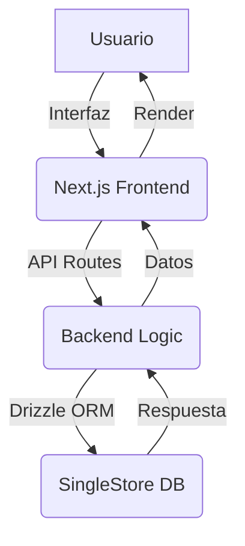

# Google Drive Clone 🚀

  
_Un almacenamiento en la nube moderno, rápido y escalable construido con tecnologías de vanguardia._

---

## ✨ Visión General

Bienvenido a **Google Drive Clone**, una aplicación web full-stack que replica las funcionalidades esenciales de Google Drive. Este proyecto combina un frontend elegante con un backend robusto para ofrecer una experiencia de usuario fluida y eficiente. Construido con **Next.js 15**, estilizado con **Tailwind CSS 4**, tipado con **TypeScript**, y potenciado por **SingleStore** con **Drizzle ORM** para una gestión de datos ultrarrápida.

### 🎯 Objetivo

Crear una solución de almacenamiento en la nube que sea:

- **Rápida:** Optimizada para cargas y descargas instantáneas.
- **Escalable:** Diseñada para manejar grandes volúmenes de datos.
- **Intuitiva:** Una interfaz moderna y fácil de usar.

---

## 🛠️ Tecnologías

| Tecnología       | Versión | Descripción                               |
| ---------------- | ------- | ----------------------------------------- |
| **Next.js**      | 15      | Framework React para SSR y SSG            |
| **Tailwind CSS** | 4       | Estilos utilitarios modernos              |
| **TypeScript**   | Latest  | Tipado estático para un código robusto    |
| **SingleStore**  | Latest  | Base de datos híbrida SQL/NoSQL           |
| **Drizzle ORM**  | Latest  | ORM ligero y performant para TypeScript   |
| **Bun**          | Latest  | Runtime y gestor de paquetes ultrarrápido |

    

---

## 🌟 Características

- **Subida de Archivos:** Arrastra y suelta archivos con soporte para múltiples formatos.
- **Organización:** Carpetas anidadas con navegación intuitiva.
- **Búsqueda Rápida:** Encuentra archivos en segundos gracias a SingleStore.
- **Interfaz Moderna:** Diseñada con Tailwind CSS 4 para una experiencia visual premium.
- **Seguridad:** Autenticación y autorización (próximamente).
- **Escalabilidad:** Arquitectura optimizada para grandes volúmenes de datos.

> 🚧 **En desarrollo:** Compartir archivos, vistas previas en tiempo real y más.

---

## 📸 Capturas de Pantalla

| Pantalla Principal                                                       | Subida de Archivos                                                         |
| ------------------------------------------------------------------------ | -------------------------------------------------------------------------- |
|  |  |

_(Nota: Reemplaza los enlaces de `via.placeholder.com` con capturas reales de tu proyecto.)_

---

## 🚀 Inicio Rápido

### Prerrequisitos

- [Node.js](https://nodejs.org/) (o [Bun](https://bun.sh/) como runtime recomendado)
- [SingleStore](https://www.singlestore.com/) (base de datos configurada)
- Git

### Instalación

1. Clona el repositorio:

   ```bash
   git clone https://github.com/tu-usuario/google-drive-clone.git
   cd google-drive-clone
   ```

2. Instala las dependencias con Bun:

   ```bash
   bun install
   ```

3. Configura las variables de entorno:

   - Copia `.env.example` a `.env`:
     ```bash
     cp .env.example .env
     ```
   - Edita `.env` con tus credenciales de SingleStore y otras configuraciones.

4. Inicia el servidor de desarrollo:

   ```bash
   bun dev
   ```

5. Abre tu navegador en [http://localhost:3000](http://localhost:3000).

---

## 🏗️ Arquitectura



- **Frontend:** Next.js 15 con Tailwind CSS 4 para una UI dinámica.
- **Backend:** API Routes de Next.js para manejar lógica y almacenamiento.
- **Base de Datos:** SingleStore con Drizzle ORM para consultas rápidas y esquema tipado.

---

## 🧪 Pruebas y Calidad

- **Typechecking:** `bun typecheck`
- **Linting:** `bun lint`
- **Tests:** `bun test` (en desarrollo)

El proyecto incluye un flujo de CI/CD con GitHub Actions para garantizar la calidad del código. Consulta [.github/workflows/ci.yml](.github/workflows/ci.yml).

---

## 🤝 Contribuir

¡Nos encantaría que formes parte del proyecto! Sigue estos pasos:

1. Haz un fork del repositorio.
2. Crea una rama para tu feature:
   ```bash
   git checkout -b feature/nueva-funcionalidad
   ```
3. Commitea tus cambios:
   ```bash
   git commit -m "Agrega nueva funcionalidad"
   ```
4. Envía un Pull Request.

Consulta [CONTRIBUTING.md](CONTRIBUTING.md) para más detalles.

---

## 📋 Roadmap

- [x] Subida y descarga de archivos
- [x] Carpetas anidadas
- [ ] Compartir archivos con enlaces
- [ ] Vista previa de documentos
- [ ] Autenticación con OAuth
- [ ] Soporte para múltiples usuarios

---

## 📜 Licencia

Este proyecto está licenciado bajo [MIT License](LICENSE). Siéntete libre de usarlo y modificarlo.

---

## 🌐 Contacto

¿Preguntas o sugerencias? Contáctame en:

- Twitter: [@tu-usuario](https://twitter.com/tu-usuario)
- Email: tu-email@dominio.com

⭐ **¡No olvides dejar una estrella si te gusta el proyecto!**
